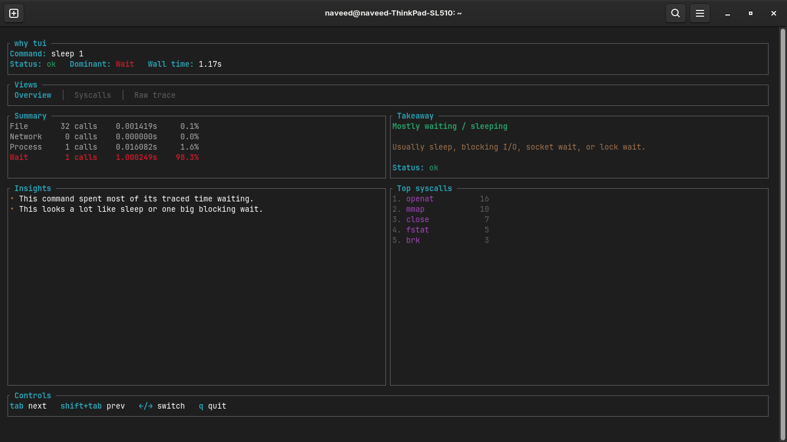
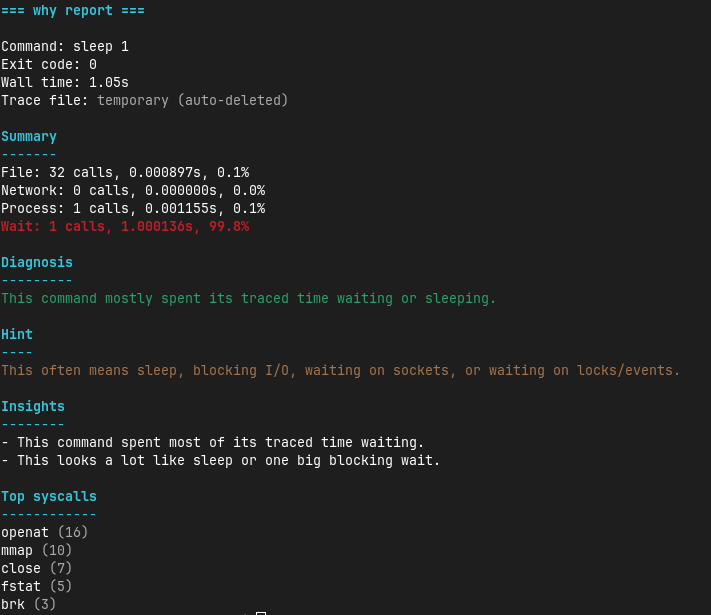

# why

<p align="center">
  
</p>

<p align="center">
  <strong>Explain why a Linux command is slow, waiting, or file-heavy.</strong>
</p>

<p align="center">
  <em>Linux CLI + TUI that explains where command time went using trace-based analysis.</em>
</p>

---

## What is `why`?

`why` is an open-source Linux CLI + TUI that helps you understand what a command was doing under the hood.

It runs a command under `strace`, groups the trace into simple categories, and shows you a cleaner explanation of where time went.

Instead of dumping a wall of noisy syscall output, `why` summarizes command activity into:

- **File**
- **Network**
- **Process**
- **Wait**

Then it gives you:

- a clean CLI report
- a fullscreen TUI dashboard
- simple diagnosis + hint
- quick insights
- top syscalls
- raw trace view in TUI

---

## Screenshots

### TUI overview



### CLI report



---

## Features

- Analyze Linux commands through a simple `why <command>` interface
- Fullscreen TUI dashboard with tabs:
  - Overview
  - Syscalls
  - Raw trace
- Category breakdowns for:
  - file
  - network
  - process
  - wait
- Traced time totals and percentages
- Top syscall summary
- Human-friendly diagnosis and hints
- Rule-based insights
- Timeout support for long-running commands
- Temporary trace files auto-delete by default
- `--keep-trace` to preserve raw trace files
- `--no-color` for plain output

---

## Why this exists

Linux already has powerful tools like `strace`, but raw traces are noisy and not very friendly.

`why` tries to answer the simpler question:

> Why did this command spend time here?

The goal is not to replace `strace`.

The goal is to make Linux tracing easier to understand.

---

## Installation

### Install from release binary

Download the latest Linux binary from the [Releases](https://github.com/mredstone31/why/releases) page.

For `v0.1.0`, download:

- `why-v0.1.0-linux-x86_64.tar.gz`

Then extract and run it:

```bash
tar -xzf why-v0.1.0-linux-x86_64.tar.gz
chmod +x why-v0.1.0-linux-x86_64
./why-v0.1.0-linux-x86_64 --help
```

To install it globally:

```bash
sudo mv why-v0.1.0-linux-x86_64 /usr/local/bin/why
why --help
```

### Install directly from Git with Cargo

```bash
cargo install --git https://github.com/mredstone31/why.git --locked
```

### Build and install from source

```bash
git clone https://github.com/mredstone31/why.git
cd why
cargo install --path . --force
```

### Build manually

Debug build:

```bash
cargo build
./target/debug/why --help
```

Release build:

```bash
cargo build --release
./target/release/why --help
```

---

## Requirements

- Linux
- `strace`
- Rust and Cargo if building from source

On Ubuntu / Debian:

```bash
sudo apt update
sudo apt install strace
```

---

## Quick start

### Analyze a simple command

```bash
why ls
```

### Analyze a sleeping command

```bash
why sleep 1
```

### Analyze a network-heavy command

```bash
why curl https://www.google.com
```

### Open the TUI dashboard

```bash
why --tui sleep 1
```

### Stop long-running commands automatically

```bash
why --timeout 2 sleep 100
```

### Keep the raw trace file

```bash
why --keep-trace curl https://www.google.com
```

### Disable colors

```bash
why --no-color ls
```

---

## Example CLI output

```text
=== why report ===

Command: sleep 1
Exit code: 0
Wall time: 1.02s
Trace file: temporary (auto-deleted)

Summary
-------
File: 40 calls, 0.001593s, 0.1%
Network: 0 calls, 0.000000s, 0.0%
Process: 1 calls, 0.000711s, 0.1%
Wait: 1 calls, 1.000191s, 99.8%

Diagnosis
---------
This command mostly spent its traced time waiting or sleeping.

Hint
----
This often means sleep, blocking I/O, waiting on sockets, or waiting on locks/events.

Insights
--------
- This command spent most of its traced time waiting.
- This looks a lot like sleep or one big blocking wait.

Top syscalls
------------
clock_nanosleep (1)
openat (20)
mmap (10)
close (7)
```

---

## TUI controls

Inside TUI mode:

- `q` quit
- `esc` quit
- `enter` quit
- `tab` next tab
- `shift+tab` previous tab
- `← / →` switch tabs
- `h / l` switch tabs
- `j / k` scroll raw trace
- `↑ / ↓` scroll raw trace
- `ctrl+d / ctrl+u` jump faster in raw trace

---

## Command-line flags

```text
Usage: why [OPTIONS] <command>...

Arguments:
  <command>...  Command to run and analyze

Options:
  -t, --timeout <SECONDS>  Stop tracing after this many seconds [default: 15]
      --tui                Show the result in a fullscreen TUI dashboard
      --keep-trace         Keep the raw trace file instead of deleting it automatically
      --no-color           Disable colored output
  -h, --help               Print help
  -V, --version            Print version
```

---

## How it works

Very roughly:

1. `why` runs your command under `strace`
2. it captures the trace in a temporary file
3. it reads the trace back into memory
4. it classifies syscalls into simple buckets
5. it sums syscall counts and traced time
6. it prints a CLI report or opens the TUI dashboard

---

## Temp trace files

By default, `why` creates a temporary trace file and deletes it automatically after reading it.

If you want to keep the raw trace, use:

```bash
why --keep-trace <command>
```

---

## Limitations

`why` is still intentionally lightweight.

Current limitations:

- Linux only
- requires `strace`
- best for commands that finish on their own
- syscall classification is heuristic-based
- not every syscall is categorized yet
- some privileged commands may fail under tracing
- traced syscall time is not the same thing as full CPU profiling
- complex programs may do lots of startup work before their “real” work begins

Example: commands like `ping` may require extra privileges or capabilities and may not behave normally under tracing.

---

## Support

If you find `why` useful and want to support development:

- **Patreon:** `https://www.patreon.com/cw/whycli`

Support helps fund future improvements and more open-source Linux developer tools.

---

## Roadmap

Possible future work:

- smarter syscall coverage
- better insight rules
- exportable reports
- JSON output
- `.deb` packaging
- PPA support later
- better install flows
- maybe live mode in the future

---

## Development

Run during development:

```bash
cargo run -- ls
cargo run -- --tui sleep 1
cargo run -- --timeout 2 sleep 100
```

Install locally as a normal command:

```bash
cargo install --path . --force
```

---

## Contributing

Issues, ideas, and feedback are welcome.

If `why` gave a bad diagnosis, weird output, or missed an obvious pattern, open an issue with:

- the command you ran
- the output you got
- what you expected instead

---

## License

Licensed under the MIT License. See [LICENSE](LICENSE).
